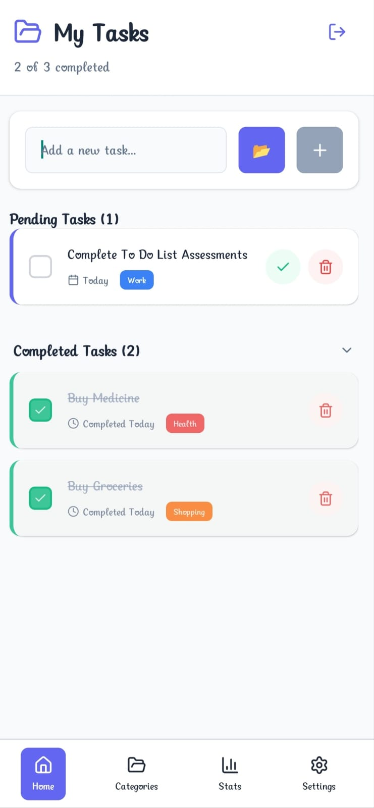
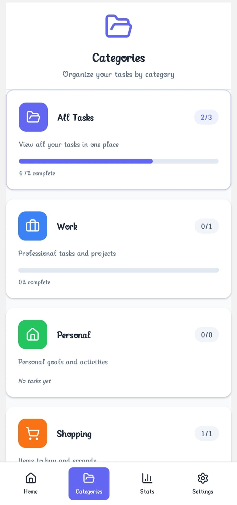
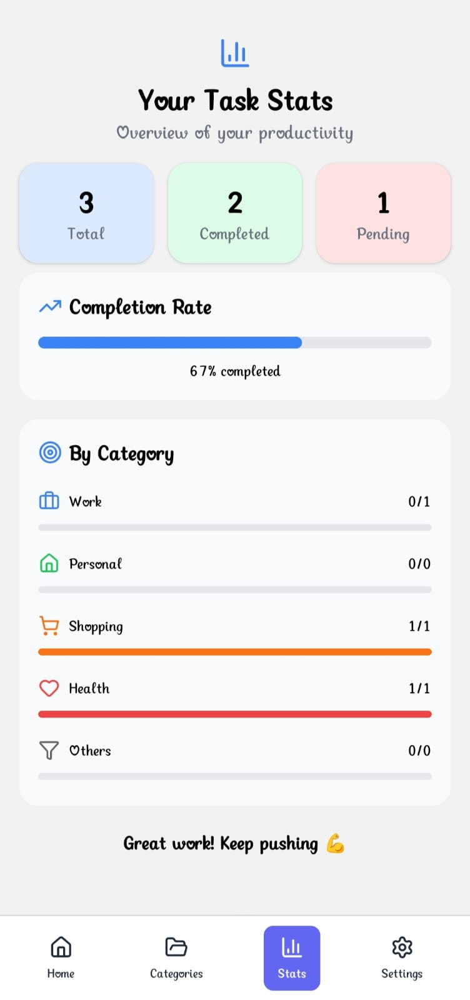
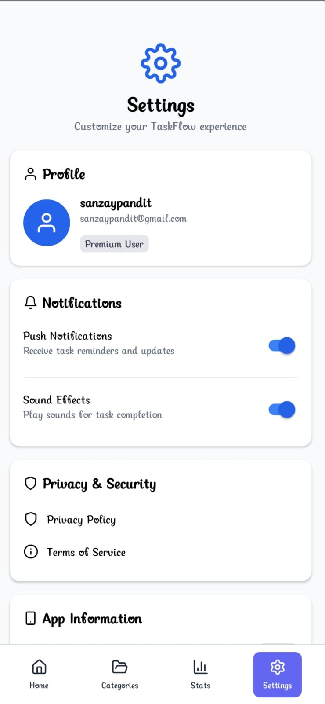

# TaskFlow - To-Do List App 📝

TaskFlow is a modern, cross-platform to-do list application built with React Native that helps you organize your tasks efficiently with categories, notifications, and a clean interface.


## Features ✨

- ✅ **Task Management**: Create, complete, and delete tasks
- 🗂️ **Categories**: Organize tasks into Work, Personal, Shopping, Health, and Others
- 🔔 **Notifications**: Get progress updates and completion alerts
- 📊 **Progress Tracking**: Visual progress indicators
- 🔐 **User Accounts**: Guest mode or authenticated users
- 💾 **Offline Storage**: Tasks persist locally on your device


### Installation

```bash
# Clone the repository
git clone https://github.com/Sanjaypandit1/To-Do-List.git
   ```

```bash
# Navigate to the project directory
cd To-Do-List
   ```

```bash
# Install dependencies
npm install
   ```

```bash
# Run the app on Android and wait for 20-30mins for running the app first time
npx react-native run-android
   ```


> ## 📷 Screenshots

### 🏠 Home Screen


### 🍕 Categories Screen


### 🛒 Stats Screen


### ❤️ Setting Screen



### Prerequisites

- Node.js (v14 or newer)
- npm or yarn
- React Native development environment setup
- Android Studio (for Android development)
